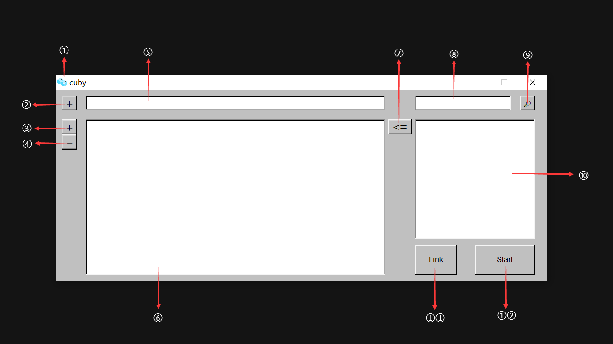

# 特点

1. 创建{番剧名 （年份）}格式的文件夹。
2. 匹配并排序特殊情况下，文件资源管理器里显示乱序的番剧。
    
    感谢[erengy/anitomy](https://github.com/erengy/anitomy)，以及[Xtansia/rust-anitomy](https://github.com/Xtansia/rust-anitomy)做的rust绑定。
3. 匹配少量特殊字符。
4. 匹配普通字幕和简、繁两种字幕同时存在或都不存在的情况。
5. 视频文件硬链接，字幕文件直接复制，不影响做种，不破坏数据，方便管理。
6. 根据番剧集名重命名。

# 安全

我知道数据安全非常重要。

本软件使用的涉及到具体文件操作的函数仅有:

[std::fs::read_dir](https://doc.rust-lang.org/stable/std/fs/fn.read_dir.html)

[std::fs::hard_link](https://doc.rust-lang.org/stable/std/fs/fn.hard_link.html)

[std::fs::copy](https://doc.rust-lang.org/stable/std/fs/fn.copy.html)

理论上不会有任何损失数据的风险，但我还是在此强调，请谨慎使用。

# 平台

代码理论上是全桌面平台适用，但目前仅在windows平台编写和测试，除此以外以外的平台都未经测试，请自行负责。

PS：
如果要求人数够多的话，或许可以再添加linux平台（Arch）支持。

至于Macos……，Mac太贵了，负担不起。

# 功能

批量处理番剧，使用bangumi_API搜索番剧信息，视频文件硬链接，字幕文件直接复制，并重命名。

在此特别感谢bangumi网站公开的API和各位维基人的番剧数据库整理工作，这是一件非常了不起的事情。

没有他们，就不会有这个项目的诞生。

[Bangumi番组计划](https://bangumi.tv/)

# 界面



①：非常可爱的图标，十分感谢来自
<a href="https://www.flaticon.com/free-icons/freeze" title="freeze icons">Freeze icons created by Freepik - Flaticon</a>
免费授权。

②：添加输出文件夹路径。

③：添加输入文件夹路径。

④：删除选定的输入文件夹路径。

⑤：显示输出文件夹路径。

⑥：显示输入文件夹路径。

⑦：设置⑩选定的番剧到左边的⑥的第一行。

⑧：搜索栏，输入关键词。

⑨：搜索键，点击开始搜索。

⑩：显示搜索到的相关番剧。

①①：仅进行创建番剧名文件夹和视频硬链接和字幕文件复制操作（应对剧集数目不足的情况）。

①②：开始硬链接、复制和重命名。

# 路径示意图

in_folder:  番剧所在文件夹路径
```
├─in_folder1  
|   ├─...  
|   ├─...  
|   ├─video.mp4(avi,flv,mkv)   
|   ├─video.sc.ass(str)
|   ├─video.tc.ass(str)
|   ├─video.ass(str)
|   ├─...
├─in_folder2  
|   ├─...  
|   ├─...  
|   ├─video.mp4(avi,flv,mkv)   
|   ├─video.sc.ass(str)
|   ├─video.tc.ass(str)
|   ├─video.ass(str)
|   ├─...
```
out_folder: 媒体库所在文件夹路径
```
├─out_folder    
|   ├─{番剧名 （年份）}  
|       ├─ep01 - title.mp4(avi,flv,mkv)     
|       ├─ep01 - title.sc.ass(str)
|       ├─ep01 - title.tc.ass(str) 
|       ├─ep01 - title.ass(str)
|       ├─……
|   ├─...  
|   ├─...
```

# TODO

- [x] GUI界面
- [x] rust重构
- [x] 批量处理
- [ ] 优化实现逻辑，减少嵌套结构和冗余代码。

# License

Licensed under the [MIT](LICENSE) license.