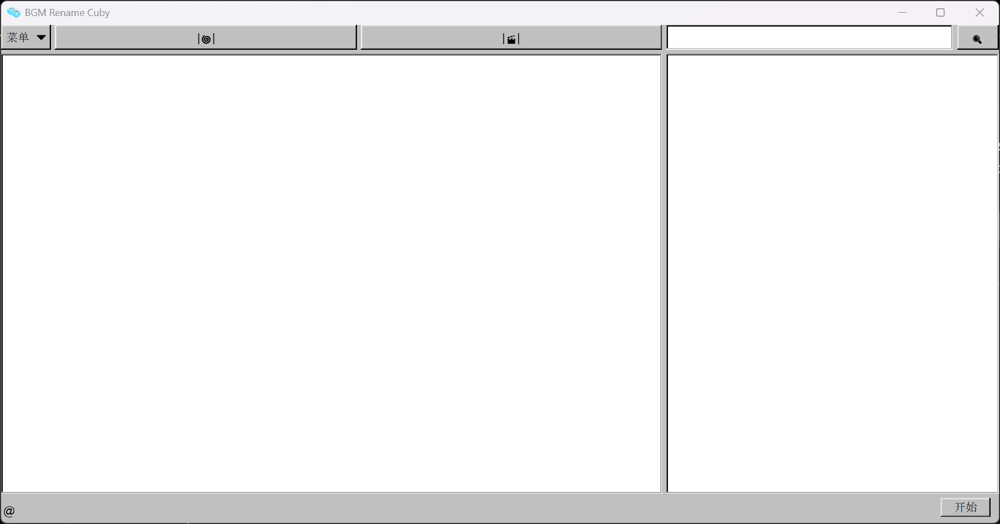

# BGM Rename Cuby v0.4.0

一个基于Bangumi API的番剧文件批量重命名工具，支持GUI界面和命令行操作。


**注意**
- 此版本后，本程序将专注处理单次任务，如有批量化需求请使用[AAA](https://github.com/uuzp/AAA)  

## 核心特点

1. **自动创建标准化文件夹** - 生成`{番剧名 (年份)}`格式的整理文件夹
2. **智能文件排序和匹配** - 解决资源管理器显示乱序问
3. **多语言字幕支持** - 自动处理简体、繁体等多语言字幕文件
4. **安全的文件操作** - 视频文件使用硬链接，字幕文件复制，不影响原始数据
5. **基于官方API** - 使用Bangumi官方API获取准确的剧集信息
6. **跨平台设计** - 理论支持全桌面平台(当前主要在Windows测试)

## 快速开始

### 方法一：右键菜单快捷启动 (推荐)
1. **以管理员身份运行程序**，点击"菜单" → "注册"来注册系统右键菜单
2. 在包含番剧文件的文件夹上右键，选择"Add To Cuby"直接启动
3. 程序会自动设置源路径并提取番剧名进行搜索

### 方法二：命令行启动
```bash
cuby.exe -b "源文件夹路径" -a "目标文件夹路径"
```

### 方法三：GUI手动操作
1. 点击🌀按钮选择包含番剧文件的源文件夹
2. 点击🎬按钮选择整理后文件的目标文件夹  
3. 在搜索框输入番剧名称，点击🔍搜索
4. 双击搜索结果加载剧集信息
5. 点击"开始"执行文件整理

## 使用说明

### 基本工作流程
1. **选择源文件夹** - 包含原始番剧文件的文件夹
2. **选择目标文件夹** - 整理后文件的存放位置
3. **搜索番剧** - 输入关键词搜索对应番剧
4. **加载剧集** - 双击搜索结果获取详细剧集信息
5. **执行整理** - 一键完成文件重命名和整理

### 智能功能
- **自动番剧名提取**: 从文件夹名自动提取番剧关键词
- **文件拖拽排序**: 支持在文件列表中拖拽调整文件顺序
- **多格式支持**: 支持常见的视频和字幕文件格式
- **语言标识处理**: 自动处理`.sc`、`.tc`等语言标识
- **重复检测**: 避免覆盖已存在的文件

## 界面说明



### 控件功能说明:
- **🧊图标** - 可爱的冰块图标，感谢 [Freepik - Flaticon](https://www.flaticon.com/free-icons/freeze) 的免费授权
- **菜单按钮** - 注册/注销右键菜单、查看关于信息、退出程序
- **🎬按钮** - 选择目标文件夹路径(整理后文件存放位置)
- **🌀按钮** - 选择源文件夹路径(原始番剧文件位置)
- **搜索框** - 输入番剧关键词(支持自动提取)
- **🔍按钮** - 执行搜索操作
- **搜索结果区域** - 显示匹配的番剧列表(双击加载剧集信息)
- **文件列表区域** - 显示源文件夹中的视频文件
- **开始按钮** - 执行文件整理操作
- **状态栏** - 显示当前路径和操作状态信息

### 操作提示:
- 🔄 双击搜索结果可加载详细剧集信息
- 🖱️ 文件列表支持拖拽排序，调整文件与剧集的对应关系
- ⚠️ 文件数量多于剧集数量时会弹出确认对话框
- ✅ 操作完成后会显示成功和失败的文件数量
- 📁 程序会自动创建番剧文件夹，避免重复操作

## 数据安全

### 安全保障
本软件只使用以下安全的文件系统函数:
- [std::fs::read_dir](https://doc.rust-lang.org/stable/std/fs/fn.read_dir.html) - 仅读取目录内容
- [std::fs::hard_link](https://doc.rust-lang.org/stable/std/fs/fn.hard_link.html) - 创建硬链接，不移动原文件
- [std::fs::copy](https://doc.rust-lang.org/stable/std/fs/fn.copy.html) - 复制字幕文件

### 安全特性
- ✅ **无损操作** - 视频文件使用硬链接，原文件完全保留
- ✅ **做种友好** - 不影响BT做种，原始文件位置不变
- ✅ **重复检测** - 自动跳过已存在的目标文件
- ✅ **路径验证** - 操作前验证所有路径的有效性

## 平台支持

- **Windows** ✅ 主要开发和测试平台
- **Linux** ⚠️ 理论支持，未经充分测试  
- **macOS** ⚠️ 理论支持，未经充分测试

> **注意**: 除Windows外的平台请自行测试，如有问题欢迎反馈

## 文件结构示例

### 源文件夹结构 (处理前):
```
源文件夹/
├─ episode_01.mkv
├─ episode_01.sc.ass
├─ episode_01.tc.ass  
├─ episode_02.mkv
├─ episode_02.sc.ass
├─ episode_02.tc.ass
├─ ...
```

### 目标文件夹结构 (处理后):
```
目标文件夹/
├─ 番剧名(年份)/
│   ├─ ep01 - 剧集标题.mkv     (硬链接)
│   ├─ ep01 - 剧集标题.sc.ass  (复制)
│   ├─ ep01 - 剧集标题.tc.ass  (复制)
│   ├─ ep02 - 剧集标题.mkv     (硬链接)
│   ├─ ep02 - 剧集标题.sc.ass  (复制) 
│   ├─ ep02 - 剧集标题.tc.ass  (复制)
│   └─ ...
```

## 故障排除

### 常见问题及解决方案

**Q: 无法注册右键菜单**
- 确保以管理员身份运行程序
- 检查Windows注册表访问权限
- 如有必要，可手动运行注销后再重新注册

**Q: 想自定义右键菜单启动时的目标文件夹路径**
- 目前是硬编码为./anime路径
- 如需修改，请手动编辑注册表
```
HKEY_CLASSES_ROOT\Directory\shell\cuby
```
- 暂未找到更好的方式设置

**Q: 搜索不到番剧**
- 检查网络连接是否正常
- 尝试使用不同的关键词搜索
- 确认番剧在Bangumi数据库中存在

**Q: 文件数量多于剧集数量**  
- 程序会弹出确认对话框询问是否继续
- 超出剧集范围的文件会被跳过
- 建议人工检查文件列表，确认没有无关文件

**Q: 部分文件处理失败**
- 检查目标路径是否有写权限
- 确认目标文件是否已存在(程序会跳过重复文件)
- 查看详细错误信息定位具体问题

**Q: 字幕文件没有被处理**
- 确认字幕文件名与视频文件名匹配
- 检查字幕文件扩展名是否支持(.srt, .ass, .ssa, .vtt等)
- 语言标识应使用`.sc`、`.tc`等标准格式

## 技术细节

### 支持的文件格式
- **视频**: mp4, avi, mkv, mov, wmv, flv, webm
- **字幕**: srt, ass, ssa, vtt, sub, idx, sup

### 字幕匹配规则
- 完全匹配: `video.mkv` → `video.srt`
- 语言标识: `video.mkv` → `video.sc.srt`, `video.tc.srt`

## 致谢

特别感谢以下项目和服务:
- [Bangumi番组计划](https://bangumi.tv/) - 提供开放的API和丰富的番剧数据库
- 所有Bangumi维基人的数据整理工作

## 更新日志

### v0.4.0 (当前版本)
- ✨ 新增右键菜单快捷启动功能(需管理员权限注册)
- ✨ 支持命令行参数预设路径
- ✨ 智能番剧名提取和自动搜索
- ✨ 文件列表支持拖拽排序功能
- 🎯 改为专注单次任务处理模式
- 🛠️ 改进错误提示和状态反馈
- 🎨 优化用户界面和操作流程
- 🔧 移除环境变量依赖，简化配置过程

## 许可证

Licensed under the [MIT](LICENSE) license.